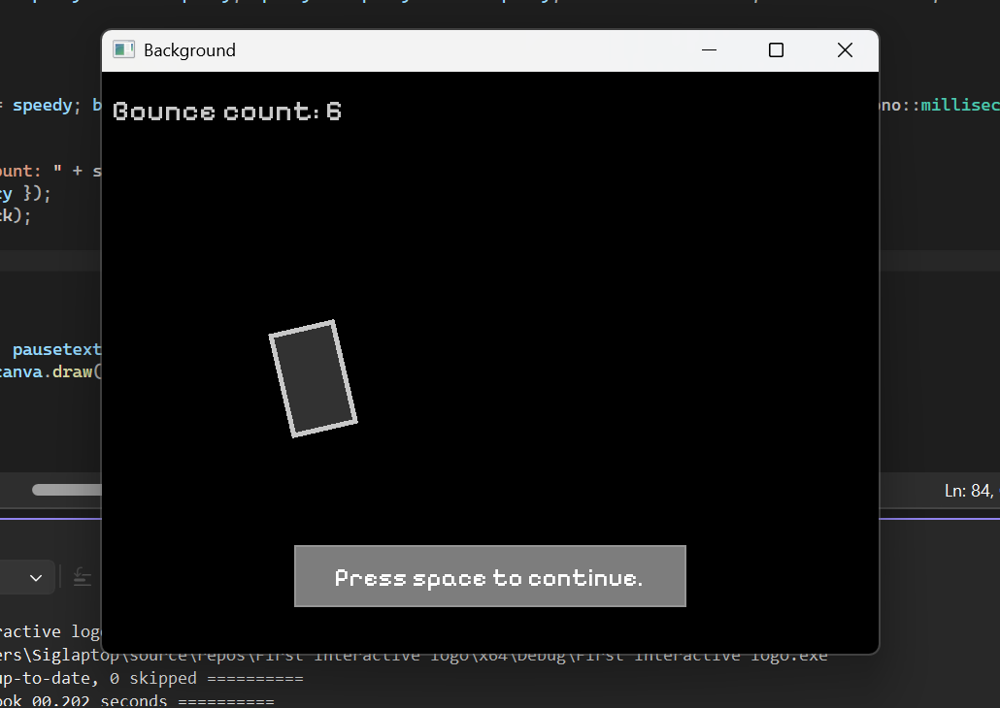

# Interactive-Bouncing-Logo
## A logo that increases exponentially as it bounces from a wall (2nd SFML Project)   Day #19 learning programming

## Features used:
### SFML, Pause & Resume, Bounce counter, Reset, Progressive speed increase, On screen control

### Screenshot

